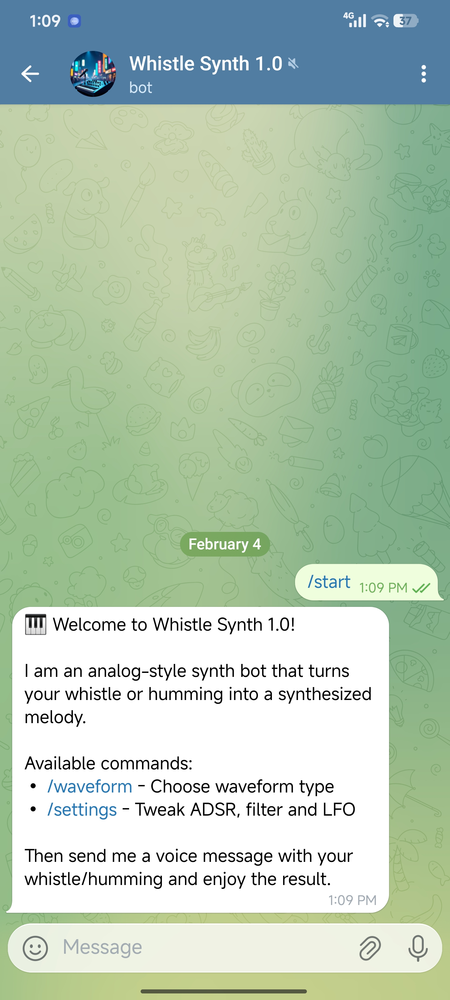
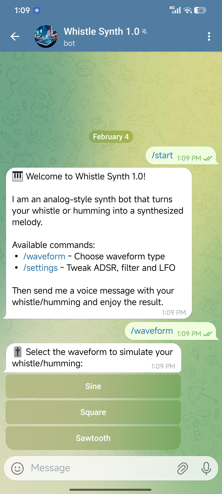
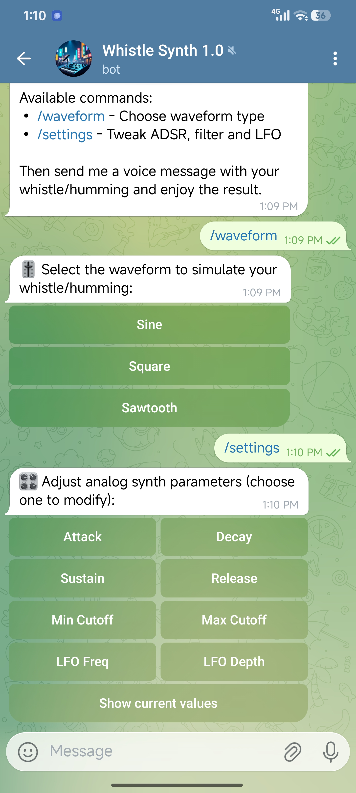
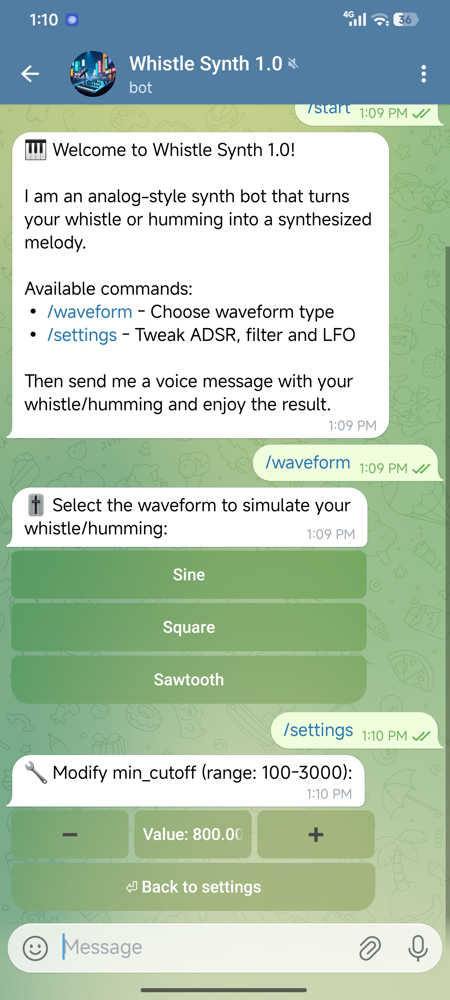
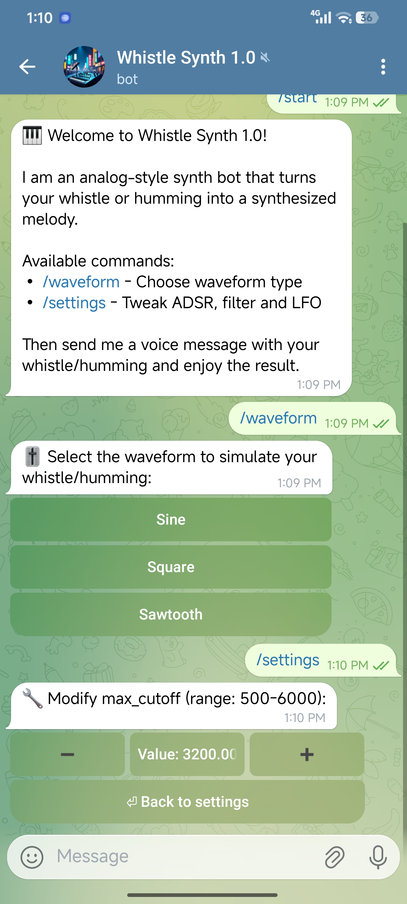
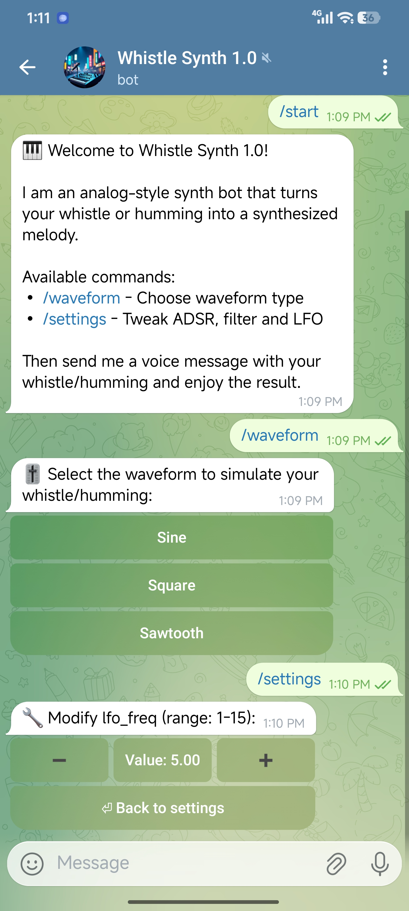
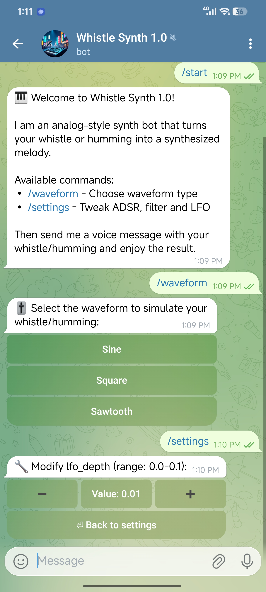
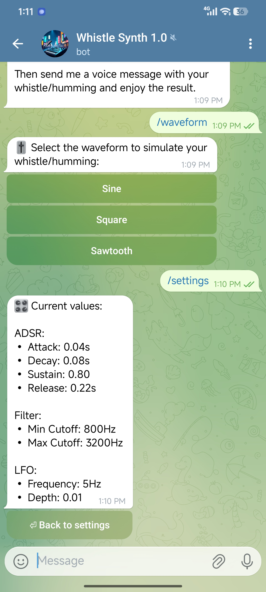
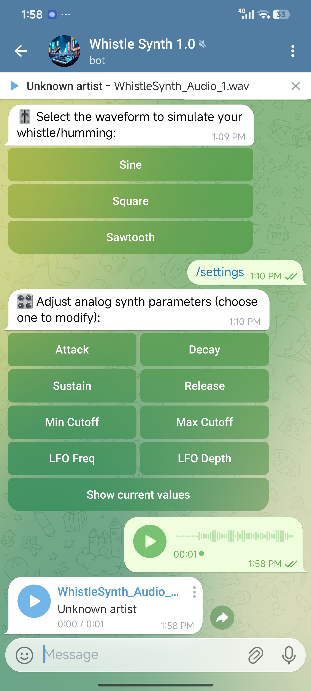

# Telegram Humming Synth Bot

Telegram bot that converts your humming into a synthesized melody using pitch detection (pYIN), digital oscillators, ADSR envelope, dynamic low‑pass filter, and LFO modulation.

## Features

- Voice message (humming / whistling) to synthesized audio.
- Waveform selection: sine, square, sawtooth.
- Analog-style controls:
  - Attack, Decay, Sustain, Release (ADSR)
  - Dynamic low‑pass filter (min/max cutoff)
  - LFO (frequency and depth) for pitch modulation.
- Interactive Telegram UI with inline buttons.

## Demo

<p align="center">
  
  
  
</p>
<p align="center"><em>Figure 1, 2 & 3 – Main Menu, Waveform Selection, and Settings parameters.</em></p>


<p align="center">
  
  
  
</p>
<p align="center"><em>Figure 4, 5 & 6 – Attack, Decay, and Sustain parameters.</em></p>

<p align="center">
  
  
  
</p>
<p align="center"><em>Figure 7, 8 & 9 – Release, Min Cut off, and Max Cut off parameters.</em></p>

<p align="center">
  
  
  
</p>
<p align="center"><em>Figure 4 – LFO Freq, LFO Depth, and Current Value parameters.</em></p>

<p align="center">
  
</p>
<p align="center"><em>Figure 4 – Recorded Audio and Processed Audio.</em></p>
## Requirements

- Python 3.10+  
- Libraries:
  - `python-telegram-bot`
  - `numpy`
  - `librosa`
  - `scipy`
  - `pydub`

Install:

```bash
pip install python-telegram-bot==21.0.1 numpy librosa scipy pydub
